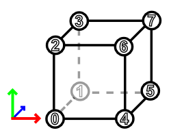

# File Format

The potree file format partitions points into an octree. All octree nodes,
intermediate as well as leaves, contain a sparse subsample of points.

The spacing defines the minimum distance between points in the root node.
With each level, the spacing is halved, e.g. if spacing in the root is 1.0,
then the spacing in its children is 0.5.
Rendering lower level nodes results in a coarse representation of the pointcloud.
The more nodes you load and render, the better the quality.

The following table shows what the content of the root and its children could
look like and how the level of detail increases when they're rendered together.

|         |  |  |  |
| ------------- |:-------------:| -----:| --- |
| r - root      | r0 - first child of root | root and r0 combined | root and all its children combined |

## Directory Hierarchy

The potree file format is actually a collection of files:
* ./cloud.js - A JSON file that contains meta data such as bounding box, spacing, etc.
* ./data/ - This directory contains node and hierarchy files.

For each octree node, there is one file in the data directory called r,
followed by a number that indicates its position in the hierarchy.
* r is the root node
* r0 is the first child of the root node
* r03 is the fourth child of the first child of the root node

Each node may have up to 8 child nodes. The numbers from 0 to 7 inside the node name
indicate which child it is.

Files inside the data directory are grouped into a hierarchical directory structure.
Each directory contains nodes for up to _hierarchyStepSize_ levels of the octree.
Subsequent nodes are stored in sub directories.

## Hierarchy Chunks
The hierarchy of a node is stored in .hrc files, in packets of 5 bytes. This list of 5-byte packets is a breadth-first traversal of the tree, starting in itself.
* 		1 byte with a mask of this node's children. E.g: 00000011 in the file r.hrc refers to the nodes r0 and r1
* 		4 bytes (unsigned long int) storing the number of points in that node.

For example, consider the following output of PotreeConverter:
*	./data/r
*	./data/r.bin
*	./data/r.hrc
*		./data/r/r0.bin
*		./data/r/r1.bin

The file ./data/r.hrc will contain 2 packs of 5-bytes with the following data:
* (3,$number_of_points_in_r.bin)
* (0,$number_of_points_in_r0.bin)
* (0,$number_of_points_in_r1.bin)

* The byte containing the value 3 (00000011 in binary) shows that the root contains the nodes r0 and r1. The tree is traversed breadth-first, so the following two lines correspond to r0 and r1, respectively:
* r0 has a value 0 for the mask (so no more children)
* r1 has a value 0 for the mask (so no more children)

The depth of the hierarchy in a .hrc file depends on the hierarchyStepSize which
is set to 5 as of now. This means that at every 5th level there are .hrc files
that contain the next 5 levels of hierarchy.


## Octree Hierarchy

Child nodes are arranged like this:



This means that node 0 is at the origin, node 1 is translated along the -z axis,
node 2 is on top of node 0 and so on.

## cloud.js

Stores information about the pointcloud in JSON format.

* __version__ - The cloud.js format may change over time. The version number is
necessary so that parsers know how to interpret the data.
* __octreeDir__ - Directory or URL where node data is stored. Usually points to
"data".
* __boundingBox__ - Contains the minimum and maximum of the axis aligned bounding box. This bounding box is cubic and aligned to fit to the octree root.
* __tightBoundingBox__ - This bounding box thightly fits the point data.
* __pointAttributes__ - Declares the point data format. May be "LAS", "LAZ" or in
case if the BINARY format an array of attributes like ["POSITION_CARTESIAN", "COLOR_PACKED", "INTENSITY"]
 * __POSITION_CARTESIAN__ - 3 x 32bit signed integers for x/y/z coordinates
 * __COLOR_PACKED__ - 4 x unsigned byte for r,g,b,a colors.
* __spacing__ - The minimum distance between points at root level.

```
{
	"version": "1.6",
	"octreeDir": "data",
	"boundingBox": {
		"lx": -4.9854,
		"ly": 1.0366,
		"lz": -3.4494,
		"ux": 0.702300000000001,
		"uy": 6.7243,
		"uz": 2.2383
	},
	"tightBoundingBox": {
		"lx": -4.9854,
		"ly": 1.0375,
		"lz": -3.4494,
		"ux": -0.7889,
		"uy": 6.7243,
		"uz": 1.1245
	},
	"pointAttributes": [
		"POSITION_CARTESIAN",
		"COLOR_PACKED"
	],
	"spacing": 0.03,
	"scale": 0.001,
	"hierarchyStepSize": 5
}
```

## Node-Files

The node files in the data directory contain the point data.
Node files can be BINARY, LAS, LAZ or anything else. This section will describe
the contents of the BINARY format.

The pointAttributes property in cloud.js describes the contents and the
order of each attribute in the BINARY format.

| Attribute Name | Format | Description |
| ------------- |:-------------:| -----: |
| POSITION_CARTESIAN | 3 x 4 byte unsigned integer | decode with: (xyz * scale) + boundingBox.min |
| COLOR_PACKED       | 4 x 1 byte unsigned char    | RGBA in range 0 - 255    |
| INTENSITY          | 1 x 2 byte unsigned short   | Intensity in range 0 - 65536     |
| CLASSIFICATION     | 1 x 1 byte unsigned char    | - |

All data is stored in little endian order.
